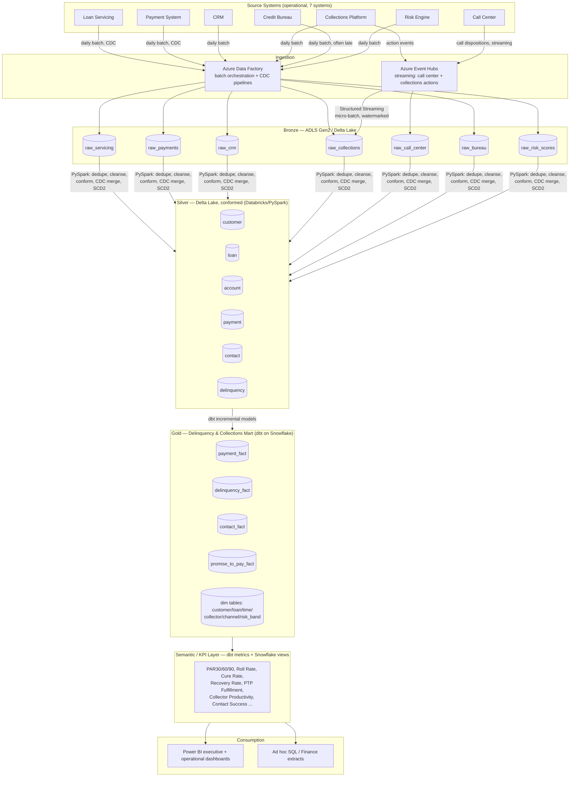
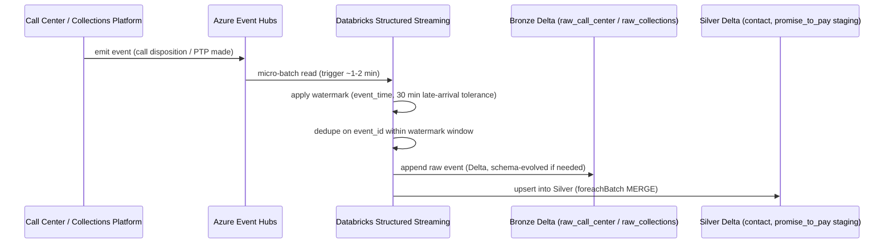

# Phase 2 — Architecture

**Traces to:** Phase 1 requirements FR-1 (Ingestion), FR-2 (DQ/Governance),
FR-3 (Modeling), NFR Scale/Latency/Security (Section 7), and the
out-of-scope/assumption boundaries in Sections 8–10.

---

## 1. Architecture Principles

1. **Medallion architecture (Bronze/Silver/Gold)** — raw fidelity is
   preserved, transformations are staged and re-runnable, and every layer
   has a clear owner and contract. This is what makes the platform
   auditable (Phase 1 FR-2.3, NFR Auditability).
2. **Separate storage from compute** — Delta Lake on ADLS is the single
   source of truth; Databricks and Snowflake are compute engines that read
   from/write to it (Snowflake via its own managed storage + Delta
   external tables/Iceberg-style access, detailed in Phase 12). This
   controls cost (Phase 1 NFR Cost) and avoids vendor lock-in on the data
   itself.
3. **Batch-first, streaming-where-it-matters** — most sources are daily
   batch (matches source-system reality: core banking/servicing systems
   rarely stream). Only Call Center dispositions and Collections Platform
   actions get a streaming path, because those are the two signals where
   minutes matter for next-best-action prioritization (Phase 1 NFR
   Latency).
4. **Metadata-driven, not hand-coded per source** — ingestion and DQ are
   parameterized off a control-table/config model so adding an 8th source
   system is a config change, not a redesign (Phase 1 NFR Extensibility).
5. **One governed semantic layer** — every KPI is defined once (dbt +
   semantic/KPI layer) and consumed everywhere, directly addressing the
   Phase 1 root-cause problem (Section 2.2: "no conformed layer between
   systems and decision-makers").

---

## 2. End-to-End Architecture Diagram

**Reading the diagram:** solid ingestion into Bronze is intentionally
system-of-record-preserving (raw, minimally touched); all
conforming/business-rule logic happens Bronze→Silver (PySpark, because
identity resolution and complex survivorship logic benefit from full
programmatic control) and Silver→Gold (dbt, because aggregation/KPI logic
benefits from SQL readability, testing, and documentation-as-code).

---

## 3. Source-to-Target Flow (high level — full schemas in Phases 6–8)

| Source System | Ingestion pattern | Bronze table(s) | Feeds these Silver conformed entities | Primary Gold facts affected |
|---|---|---|---|---|
| Loan Servicing | Daily batch, CDC (upsert+soft-delete) | `raw_servicing` | `loan`, `account` | `delinquency_fact` |
| Payment System | Daily batch, CDC; includes reversals/returns | `raw_payments` | `payment` | `payment_fact` |
| CRM | Daily batch | `raw_crm` | `customer` | dims only (`customer_dim`) |
| Collections Platform | Daily batch (case/strategy data) **+** streaming (agent actions, PTPs) | `raw_collections` | `contact`, `delinquency` | `contact_fact`, `promise_to_pay_fact` |
| Call Center | Streaming (dispositions), daily batch reconciliation | `raw_call_center` | `contact` | `contact_fact` |
| Credit Bureau | Daily batch, frequently late-arriving, sometimes missing entirely | `raw_bureau` | feeds `risk_band_dim` inputs | `delinquency_fact` (risk band) |
| Risk Engine | Daily batch | `raw_risk_scores` | feeds `risk_band_dim` inputs | `delinquency_fact` (risk band) |

---

## 4. CDC & Streaming Ingestion Design

### 4.1 Batch CDC (Loan Servicing, Payments, and other slowly-changing sources)

**Approach chosen:** merge on **natural business key** + **source update
timestamp** ("timestamp-based merge/upsert"), landing every batch as an
immutable, timestamped file in Bronze, then applying `MERGE INTO` logic in
Silver. Full detail, SQL, and worked examples live in Phase 7 (Silver
Layer) since that's where the merge logic is actually implemented — this
section defines the *pattern*, not the SQL.

- **Why this approach (vs. log-based CDC / Debezium-style binlog
  streaming):** our source systems are simulated core-banking-style
  platforms that in real banks are frequently mainframe/legacy or
  vendor-locked-down (no binlog access, or access is a multi-quarter
  infosec approval process). Timestamp+key merge is what's actually
  achievable against most core banking and servicing platforms in
  practice, and it's fully sufficient for daily-grain decisions.
- **Why not full-file reload every day:** doesn't scale to "millions of
  loans" (Phase 1 NFR Scale) and destroys the ability to see intra-day/
  inter-day change history without extra snapshotting logic — CDC gives
  us change history "for free" in Silver via SCD2.
- **Trade-off accepted:** timestamp-based CDC cannot detect a **hard
  delete** unless the source also sends a delete/tombstone record or a
  full-key reconciliation file periodically confirms which keys are still
  active. We require each source extract to include either (a) an
  explicit `is_deleted`/status flag, or (b) a periodic full-key snapshot
  for reconciliation — documented per-source in Phase 6.

### 4.2 Streaming ingestion (Call Center dispositions, Collections Platform agent actions)

- **Event-time processing + watermarking:** events carry `event_time`
  (when the call/action actually happened) separately from
  `ingestion_time` (when Event Hubs received it). We window and
  aggregate on `event_time` so a call that's delayed in transit (mobile
  agent app offline, later syncs) still lands in the correct time
  bucket. Watermark is set to **30 minutes** — chosen because
  collections agent tools in practice sync within minutes, not hours;
  30 minutes gives buffer without holding state indefinitely. Events
  arriving *after* the watermark closes are still written to Bronze
  (never dropped) but flagged `late_arrival = true` and handled by the
  Silver batch reconciliation job rather than the streaming aggregation,
  preserving Bronze fidelity while keeping streaming-state bounded.
- **Why Event Hubs over Kafka (self-managed) or Service Bus:** Event
  Hubs is the native Azure PaaS event-streaming service with built-in
  Databricks Structured Streaming connectors, Kafka-protocol
  compatibility (portability if we ever migrate), and no cluster
  ops burden — appropriate for a platform-team-of-one-to-few and
  consistent with the Azure-first stack. Self-managed Kafka is the
  right call at higher event volumes or when multi-cloud portability is
  a hard requirement; noted as an alternative, not selected here.
- **Exactly-once-ish semantics:** Delta Lake's `MERGE` + Structured
  Streaming's checkpointing gives effectively-once processing on
  restart/failure (checkpoint offsets + idempotent merge on
  `event_id`), covered operationally in Phase 10.

### 4.3 Schema evolution & schema drift

- **Schema evolution (expected, additive changes)**: new nullable
  columns from a source are auto-merged into Bronze Delta tables via
  `mergeSchema` option; Silver models fail loudly (dbt test / PySpark
  schema check) if a *new required* business field appears undeclared,
  forcing a conscious decision rather than silent absorption.
- **Schema drift (unexpected/breaking changes — renamed column, type
  change, a source vendor upgrade)**: Bronze ingestion validates incoming
  schema against a registered expected schema (per source, versioned in
  a config table) before writing; a drift beyond the allow-list quarantines
  the batch and pages the on-call data engineer rather than landing bad
  data silently. Full DQ mechanics in Phase 14.

---

## 5. Technology Stack — Component-by-Component Justification

| Component | Chosen | Why | Alternatives considered | Why not chosen |
|---|---|---|---|---|
| Data Lake | **Azure Data Lake Storage Gen2** | Native Delta Lake support, hierarchical namespace (cheap directory-level operations at scale), integrates with ADF/Databricks/Event Hubs with no custom connectors | AWS S3 + equivalent stack, GCS | Valid equally-good choices; ADLS chosen to match an Azure-first enterprise stack (common in banking due to existing Microsoft enterprise agreements) |
| Batch orchestration | **Azure Data Factory** | Native Azure integration, built-in CDC connectors for many enterprise sources, visual + JSON-as-code pipelines, good fit for a bank's existing Azure landing zone | Airflow (self-hosted or Astronomer/MWAA), Databricks Workflows | Airflow is arguably more portable/interview-standard for pure orchestration — **so we build an Airflow comparison in Phase 11** to show both; ADF chosen as primary because CDC-from-enterprise-source connectors and Azure governance integration (Purview, private endpoints) are stronger out of the box |
| Streaming ingestion | **Azure Event Hubs** | Managed, Kafka-protocol compatible, native Structured Streaming connector | Self-managed Kafka, Azure Service Bus | Kafka self-managed = more ops burden with no benefit at this volume; Service Bus is message-queue-oriented (competing consumers, not a log), wrong abstraction for replayable event streams |
| Processing engine (Bronze/Silver) | **Databricks + PySpark + Delta Lake** | Best-in-class for complex programmatic transforms (identity resolution, survivorship logic, streaming), Delta Lake gives ACID merges + time travel, strong for the "millions of loans" scale requirement | Synapse Spark, plain PySpark on AKS | Databricks chosen for developer productivity (notebooks, job orchestration, Unity Catalog governance) and because it's the dominant enterprise lakehouse engine — highly interview-relevant |
| Transformation (Silver→Gold) | **dbt** | SQL-native, version-controlled, self-documenting, built-in testing, dominant in modern analytics-engineering hiring — directly relevant to "Analytics Engineer" target roles in Phase 1 | Pure PySpark for Gold too, stored procedures in Snowflake | dbt chosen because Gold-layer logic (aggregation, KPI definitions) is fundamentally SQL-shaped and benefits enormously from dbt's test/doc/lineage tooling; PySpark reserved for where it earns its complexity (Bronze/Silver) |
| Serving warehouse | **Snowflake** | Separates BI-serving compute from engineering compute (cost isolation), excellent Power BI/Tableau connector performance, strong RBAC/governance, near-universal in enterprise BI-serving layers | Databricks SQL Warehouse (serve directly from lakehouse), Synapse Dedicated SQL Pool | A pure lakehouse (Databricks SQL) is a legitimate, increasingly common simplification — **documented as an explicit alternative architecture in Section 6 below** — but the hybrid pattern is still extremely common in large banks (existing Snowflake investment, BI team skillset) and is more broadly interview-relevant to show we can justify both |
| BI | **Power BI** (primary), **Tableau** (secondary/comparison, per original brief) | Power BI: native Microsoft stack fit, strong for exec dashboards, row-level security, cost-effective at scale for a bank already on M365/Azure | Tableau primary, Looker | Power BI primary because it's the dominant enterprise choice when the rest of the stack is Azure-first; Tableau built in parallel (Phase 13) specifically because many banking BI teams run Tableau and it's a common interview ask |
| Version control | **Git + GitHub** | Standard; dbt/PySpark/ADF-as-code all version well as text/JSON | GitLab, Azure DevOps Repos | Azure DevOps is arguably more "enterprise Azure-native" and will be discussed in Phase 15 CI/CD, but GitHub used here for portfolio visibility/reviewability |
| Orchestration comparison | **Airflow** (optional, Phase 11) | Included specifically because it's the most commonly asked-about orchestrator in DE interviews even when ADF is used in production | — | Built as a comparison artifact, not a competing production path |

---

## 6. Alternative Architecture Considered (documented, not built): Pure Lakehouse

A fully valid, increasingly common alternative is to **drop Snowflake**
and serve Power BI directly from Databricks SQL Warehouses on Delta
Lake (single-engine lakehouse, e.g. via Unity Catalog + Databricks SQL).

- **Pros:** one engine to operate, one copy of data, simpler lineage,
  often cheaper at moderate scale.
- **Cons (why we didn't pick it as primary):** many large banks have
  existing, sunk Snowflake investment and BI-team skillsets; separating
  "engineering compute" (Databricks, bursty/heavy ETL) from "BI-serving
  compute" (Snowflake, concurrent dashboard queries) gives cleaner cost
  attribution and blast-radius isolation — an ETL job runaway can't
  degrade executive dashboard performance.
- **Portfolio value of documenting both:** in interviews, being able to
  say "I chose the hybrid pattern for X and Y reasons, but here's when
  I'd collapse to a single-engine lakehouse instead" demonstrates
  architectural judgment rather than tool-following. This alternative is
  referenced again in Phase 12 (Snowflake) and Phase 16 (cost
  optimization).

---

## 7. Non-Functional Architecture Concerns (overview — deep dives in later phases)

- **Partitioning strategy (preview, detailed in Phases 6–8):** Bronze
  partitioned by ingestion date; Silver/Gold fact tables partitioned by
  event date (payment date, contact date, snapshot date) since nearly
  all queries and KPI windows filter by date range first.
- **Security architecture (preview, detailed in Phase 16):** network
  isolation (private endpoints for ADLS/Databricks/Snowflake), Unity
  Catalog / Snowflake RBAC for column-level PII masking, and the
  role-based access model from Phase 1 NFR Security (collector vs.
  manager vs. executive visibility).
- **Monitoring & observability (preview, detailed in Phases 10–11):**
  pipeline run status, DQ pass/fail rates, freshness SLAs, and cost, all
  surfaced to a monitoring layer (Databricks Jobs/ADF monitoring +
  alerting hooks) — not a separate dashboard-of-dashboards for this
  portfolio scope, but the hooks are designed for one.
- **Environments:** dev → test/UAT → prod promotion path, with
  synthetic data safe to use in all three (no PII exposure risk since
  nothing is real) — CI/CD promotion strategy detailed in Phase 15.

---

## 8. Design Rationale Summary (why-alternatives-best practice-interview format)

**Why medallion over a single flattened warehouse-only design:**
A single-layer design (source → one big reporting table) is faster to
build initially but fails the Phase 1 requirements around auditability
(FR-2.3), reprocessing/backfills, and supporting both raw fidelity and
governed KPIs from the same platform — you can't cleanly re-derive Silver
if you never kept Bronze. Medallion is now the de facto enterprise
lakehouse standard specifically because it separates these concerns.

**Alternatives considered (platform-level):** Kimball-style warehouse-only
(no lakehouse), fully streaming-first (Kappa architecture), single-cloud
pure-lakehouse (Section 6). Each rejected or partially adopted for the
specific reasons above.

**Enterprise best practices reflected:**
- Storage/compute separation for cost governance.
- Layer-appropriate tooling (PySpark for complex identity/streaming logic,
  SQL/dbt for declarative aggregation) rather than one hammer for every
  nail.
- Explicit, versioned schema contracts between layers (schema
  evolution vs. drift handling, Section 4.3).
- Documented alternatives at every major decision point — auditable
  architecture decisions, not just an architecture.

**Common interview questions for this phase:**
- *"Walk me through your architecture end to end."* → Use the Section 2
  diagram narrative: 7 sources → ADF/Event Hubs → Bronze → PySpark/Databricks
  Silver → dbt/Snowflake Gold → semantic layer → Power BI.
- *"Why both Databricks and Snowflake — isn't that redundant?"* → Section 5
  row + Section 6 alternative-architecture discussion; lead with cost/
  blast-radius isolation, acknowledge the valid single-engine alternative.
- *"How do you handle a source system that can't give you CDC/log access?"*
  → Section 4.1: timestamp+key merge pattern, explicit handling of hard
  deletes via status flag or periodic full-key reconciliation.
- *"How do you handle late-arriving streaming events?"* → Section 4.2:
  event-time processing, 30-min watermark, `late_arrival` flag, never
  silently dropped.
- *"How would this scale to 10x the data volume?"* → Partitioning
  (Section 7), incremental dbt models (Phase 9), Databricks
  autoscaling/cluster sizing (Phase 10), Snowflake warehouse
  scaling/clustering (Phase 12) — architecture doesn't change, configuration
  and partition/cluster keys do.

---

## Next

**Phase 3 — Data Modeling**: full star schema — `payment_fact`,
`delinquency_fact`, `contact_fact`, `promise_to_pay_fact`, and
`customer_dim`, `loan_dim`, `time_dim`, `collector_dim`, `channel_dim`,
`risk_band_dim` — with columns, keys, SCD strategy, sample records, ERD,
and cardinality for every table.

Say **"continue to Phase 3"** (or flag changes to Phase 2) when ready.
