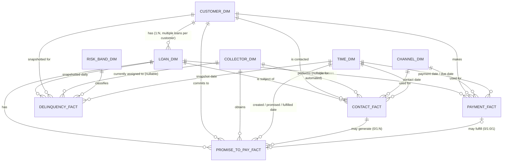

# Phase 3 — Data Modeling

**Traces to:** Phase 1 FR-3 (Modeling), FR-3.2 (SCD2 for bucket/risk-band
history), FR-3.3 (point-in-time snapshots); Phase 2 Gold layer design.

**Modeling pattern:** Kimball-style **star schema**, one fact table per
business process (payments, delinquency snapshots, contact events,
promises-to-pay), conformed dimensions shared across facts. Grain is
declared explicitly for every fact — the single most important (and most
commonly interview-tested) decision in dimensional modeling.

---

## 1. Entity-Relationship Diagram

**Note on joint applicants (from Phase 1's "Multiple loans per customer,
Joint applicants" data scenarios):** `loan_dim` carries a single
`primary_customer_sk`. Joint/co-applicant relationships are modeled via a
lightweight bridge, `loan_applicant_bridge`, documented in Section 9,
rather than forcing a many-to-many into the core star — this keeps the
four required fact tables clean (single-valued customer per fact row) and
is the standard Kimball pattern for handling multi-valued dimensions
without a fan-trap.

---

## 2. Dimension Tables

### 2.1 `customer_dim`

**Business purpose:** the conformed, identity-resolved "golden record" for
a borrower — one row per customer per version of their descriptive
attributes. Identity resolution/survivorship logic (merging CRM +
Servicing + Bureau views of the same person) happens in Silver (Phase 7);
this dimension is the Gold-layer output of that process.

| Column | Type | Key | Notes |
|---|---|---|---|
| `customer_sk` | `NUMBER` | **PK**, surrogate | Identity-column, generated at Silver→Gold load |
| `customer_id` | `VARCHAR(20)` | Natural key | Conformed golden-record ID (post survivorship, Phase 7) |
| `first_name` | `VARCHAR(100)` | | |
| `last_name` | `VARCHAR(100)` | | |
| `date_of_birth` | `DATE` | | |
| `ssn_last4` | `VARCHAR(4)` | | Tokenized/masked upstream; never full SSN in Gold |
| `email` | `VARCHAR(255)` | | Masked for non-privileged roles (Phase 16 RBAC) |
| `phone_number` | `VARCHAR(20)` | | Masked for non-privileged roles |
| `mailing_city` | `VARCHAR(100)` | | |
| `mailing_state` | `VARCHAR(2)` | | |
| `mailing_zip` | `VARCHAR(10)` | | |
| `customer_segment` | `VARCHAR(30)` | | Mass / Affluent / Private Bank |
| `employment_status` | `VARCHAR(30)` | | Employed / Self-Employed / Unemployed / Retired |
| `bureau_fico_band` | `VARCHAR(20)` | | Latest bureau-sourced FICO band (also see `risk_band_dim` for loan-level internal risk band) |
| `relocated_flag` | `BOOLEAN` | | Set true if address changed since prior version (relocation scenario) |
| `effective_start_date` | `DATE` | | SCD2 |
| `effective_end_date` | `DATE` | | SCD2, `9999-12-31` if current |
| `is_current` | `BOOLEAN` | | SCD2 |
| `source_system` | `VARCHAR(30)` | | CRM / SERVICING / BUREAU (whichever contributed the change) |
| `dw_load_ts` | `TIMESTAMP_NTZ` | | |

**SCD strategy:** **Type 2**. Address, employment status, segment, and
FICO band all change over the life of a relationship and roll-rate/cure
analysis needs to know a customer's attributes *as of the delinquency
event*, not their attributes today — this is the single most common SCD1
mistake in collections analytics (silently rewriting history).
**Partition/cluster:** Snowflake clustering key `(is_current, customer_id)`;
Delta Bronze/Silver equivalents partitioned by `load_date`.
**Indexes:** unique constraint on `(customer_id, effective_start_date)`.

**Sample records:**

| customer_sk | customer_id | first_name | last_name | mailing_state | customer_segment | bureau_fico_band | effective_start_date | effective_end_date | is_current |
|---|---|---|---|---|---|---|---|---|---|
| 100045 | CUST-0088231 | Maria | Chen | CA | Mass | 680–719 | 2024-01-03 | 2024-09-14 | FALSE |
| 100046 | CUST-0088231 | Maria | Chen | TX | Mass | 700–739 | 2024-09-15 | 9999-12-31 | TRUE |

*(same `customer_id`, two versions — relocation CA→TX and a FICO band
improvement triggered a new SCD2 row.)*

---

### 2.2 `loan_dim`

**Business purpose:** one row per version of a loan's descriptive/contract
attributes — product terms, restructuring, charge-off status.

| Column | Type | Key | Notes |
|---|---|---|---|
| `loan_sk` | `NUMBER` | **PK**, surrogate | |
| `loan_id` | `VARCHAR(20)` | Natural key | Source servicing-system loan number |
| `primary_customer_sk` | `NUMBER` | **FK** → `customer_dim` | Primary borrower (see bridge for co-applicants) |
| `loan_type` | `VARCHAR(30)` | | Auto / Personal / Credit Card / HELOC / Mortgage |
| `loan_sub_product` | `VARCHAR(50)` | | e.g., "New Auto 60mo", "Unsecured Personal" |
| `origination_date` | `DATE` | | |
| `disbursement_date` | `DATE` | | |
| `origination_amount` | `NUMBER(18,2)` | | |
| `interest_rate` | `NUMBER(6,4)` | | |
| `loan_term_months` | `NUMBER(4,0)` | | |
| `maturity_date` | `DATE` | | |
| `is_secured_flag` | `BOOLEAN` | | |
| `collateral_type` | `VARCHAR(30)` | | Vehicle / Real Estate / None |
| `restructured_flag` | `BOOLEAN` | | True after a loan-modification event |
| `restructure_date` | `DATE` | | Nullable |
| `settlement_flag` | `BOOLEAN` | | True if under a settlement agreement |
| `charge_off_flag` | `BOOLEAN` | | |
| `charge_off_date` | `DATE` | | Nullable |
| `fraud_flag` | `BOOLEAN` | | From Risk Engine fraud signal |
| `effective_start_date` | `DATE` | | SCD2 |
| `effective_end_date` | `DATE` | | SCD2 |
| `is_current` | `BOOLEAN` | | SCD2 |
| `source_system` | `VARCHAR(30)` | | |
| `dw_load_ts` | `TIMESTAMP_NTZ` | | |

**SCD strategy:** **Type 2** — restructuring, settlement, and charge-off
are exactly the events collections analysts need to see change over time
(e.g., "was this loan already restructured before it rolled to 90 DPD?").
**Partition/cluster:** Snowflake clustering `(is_current, loan_type,
loan_id)`. **Indexes:** unique `(loan_id, effective_start_date)`; index
on `charge_off_flag` for fast portfolio filtering.

**Sample record:**

| loan_sk | loan_id | primary_customer_sk | loan_type | origination_amount | restructured_flag | charge_off_flag | is_current |
|---|---|---|---|---|---|---|---|
| 500219 | LN-7734210 | 100046 | Auto | 28,500.00 | TRUE | FALSE | TRUE |

---

### 2.3 `time_dim`

**Business purpose:** standard conformed date dimension; enables every
fact to be sliced consistently by calendar/fiscal attributes and supports
the holiday/month-end seasonality scenarios from Phase 1.

| Column | Type | Key | Notes |
|---|---|---|---|
| `date_sk` | `NUMBER(8,0)` | **PK**, natural | `YYYYMMDD` int — doubles as surrogate and natural key by convention |
| `full_date` | `DATE` | | |
| `day_of_week_name` | `VARCHAR(10)` | | |
| `day_of_month` | `NUMBER(2,0)` | | |
| `day_of_year` | `NUMBER(3,0)` | | |
| `week_of_year` | `NUMBER(2,0)` | | |
| `month_number` | `NUMBER(2,0)` | | |
| `month_name` | `VARCHAR(10)` | | |
| `quarter` | `NUMBER(1,0)` | | |
| `year` | `NUMBER(4,0)` | | |
| `is_weekend` | `BOOLEAN` | | |
| `is_us_bank_holiday` | `BOOLEAN` | | Drives "holiday payment spike/dip" scenario |
| `is_month_end` | `BOOLEAN` | | Drives "month-end spike" scenario |
| `fiscal_period` | `VARCHAR(10)` | | Bank fiscal calendar label |

**SCD strategy:** **Type 0** (static reference, pre-populated for a
10-year span). **Partition/cluster:** none needed (small, fully cached
dimension). **Indexes:** PK on `date_sk`, unique on `full_date`.
This is a **role-playing dimension** — the same physical table is joined
multiple times per fact under different aliases (e.g., `payment_date`,
`due_date` in `payment_fact`), detailed in Section 3.

---

### 2.4 `collector_dim`

**Business purpose:** one row per version of a collector's team/role
assignment — needed because collectors get reassigned, promoted, or move
teams, and productivity KPIs must reflect who owned the account *at the
time*.

| Column | Type | Key | Notes |
|---|---|---|---|
| `collector_sk` | `NUMBER` | **PK**, surrogate | |
| `collector_id` | `VARCHAR(20)` | Natural key | Source collections-platform agent ID |
| `collector_name` | `VARCHAR(100)` | | |
| `hire_date` | `DATE` | | |
| `team_name` | `VARCHAR(50)` | | e.g., "Early Stage 1-29", "Late Stage 90+", "Recovery" |
| `collector_level` | `VARCHAR(20)` | | Junior / Senior / Team Lead |
| `manager_name` | `VARCHAR(100)` | | |
| `is_active_flag` | `BOOLEAN` | | |
| `effective_start_date` | `DATE` | | SCD2 |
| `effective_end_date` | `DATE` | | SCD2 |
| `is_current` | `BOOLEAN` | | SCD2 |

**SCD strategy:** **Type 2** — a collector reassigned from "Early Stage"
to "Recovery" mid-quarter must have historical `contact_fact`/
`promise_to_pay_fact` rows still attribute correctly to the team they were
on *at the time of the contact* for productivity reporting. **Partition/
cluster:** small dimension, no partitioning needed; index on
`(collector_id, is_current)`.

**Sample record:**

| collector_sk | collector_id | collector_name | team_name | collector_level | is_current |
|---|---|---|---|---|---|
| 3012 | COL-0142 | James Whitfield | Late Stage 90+ | Senior | TRUE |

---

### 2.5 `channel_dim`

**Business purpose:** conformed reference of every contact/payment
channel, enabling channel-effectiveness analysis (a named business
objective).

| Column | Type | Key | Notes |
|---|---|---|---|
| `channel_sk` | `NUMBER` | **PK**, surrogate | |
| `channel_code` | `VARCHAR(20)` | Natural key | e.g., `OUTBOUND_CALL`, `SMS`, `IVR`, `LETTER`, `EMAIL`, `ACH`, `BRANCH` |
| `channel_name` | `VARCHAR(50)` | | Display name |
| `channel_category` | `VARCHAR(30)` | | Live Agent / Automated / Written / Digital Self-Serve |
| `is_digital_flag` | `BOOLEAN` | | |
| `is_outbound_flag` | `BOOLEAN` | | |

**SCD strategy:** **Type 1** — channel definitions are reference data;
mid-life reclassification (rare) simply overwrites, since we don't need
"as-of" history for what a channel *is*, only for what happened through it
(captured in the facts). **Partition/cluster:** none (tiny dimension).

**Sample records:**

| channel_sk | channel_code | channel_name | channel_category | is_digital_flag |
|---|---|---|---|---|
| 12 | OUTBOUND_CALL | Outbound Agent Call | Live Agent | FALSE |
| 15 | SMS | SMS Reminder | Automated | TRUE |
| 18 | IVR | Interactive Voice Response | Automated | FALSE |

---

### 2.6 `risk_band_dim`

**Business purpose:** conformed internal risk-band reference, sourced from
the Risk Engine (and informed by bureau score), used to classify loans in
`delinquency_fact` for portfolio risk segmentation.

| Column | Type | Key | Notes |
|---|---|---|---|
| `risk_band_sk` | `NUMBER` | **PK**, surrogate | |
| `risk_band_code` | `VARCHAR(10)` | Natural key | `R1`...`R7` |
| `risk_band_name` | `VARCHAR(30)` | | Super Prime / Prime / Near Prime / Subprime / Deep Subprime |
| `score_range_low` | `NUMBER(5,0)` | | |
| `score_range_high` | `NUMBER(5,0)` | | |
| `band_source` | `VARCHAR(30)` | | `INTERNAL_RISK_ENGINE` / `BUREAU_FICO` |
| `band_definition_version` | `VARCHAR(10)` | | Model-risk-governance version tag |
| `effective_start_date` | `DATE` | | SCD2 |
| `effective_end_date` | `DATE` | | SCD2 |
| `is_current` | `BOOLEAN` | | SCD2 |

**SCD strategy:** **Type 2** — banks periodically **recalibrate risk-band
thresholds** (model governance events); historical delinquency facts must
keep referencing the band definition that was in force at the time, or
trend lines silently and incorrectly shift. This directly reflects the
SR 11-7-style model-risk-governance concern noted in Phase 1.
**Partition/cluster:** none (tiny dimension); index `(risk_band_code,
is_current)`.

**Sample record:**

| risk_band_sk | risk_band_code | risk_band_name | score_range_low | score_range_high | band_definition_version | is_current |
|---|---|---|---|---|---|---|
| 4 | R4 | Near Prime | 620 | 659 | v2.1 | TRUE |

---

## 3. Fact Tables

### 3.1 `payment_fact`

**Business purpose:** every payment-related transaction — scheduled
payments, extra payments, reversals, returns, settlements, and recoveries.
**Grain: one row per payment transaction event.**

| Column | Type | Key | Notes |
|---|---|---|---|
| `payment_id` | `VARCHAR(30)` | **PK**, degenerate dimension / natural key | Source payment-system transaction ID |
| `loan_sk` | `NUMBER` | **FK** → `loan_dim` | |
| `customer_sk` | `NUMBER` | **FK** → `customer_dim` | |
| `payment_date_sk` | `NUMBER(8,0)` | **FK** → `time_dim` (role: payment date) | |
| `due_date_sk` | `NUMBER(8,0)` | **FK** → `time_dim` (role: scheduled due date) | Role-playing dimension |
| `channel_sk` | `NUMBER` | **FK** → `channel_dim` | Payment channel (ACH, branch, etc.) |
| `payment_amount` | `NUMBER(18,2)` | | Negative for reversals |
| `scheduled_amount` | `NUMBER(18,2)` | | |
| `payment_type` | `VARCHAR(20)` | | Scheduled / Extra / Settlement / Recovery |
| `payment_method` | `VARCHAR(20)` | | ACH / Debit / Check / Wire / Cash |
| `payment_status` | `VARCHAR(20)` | | Posted / Reversed / Returned / Pending |
| `is_reversal_flag` | `BOOLEAN` | | |
| `original_payment_id` | `VARCHAR(30)` | **FK** (self-referencing) → `payment_fact.payment_id` | Nullable, links a reversal to the original |
| `nsf_flag` | `BOOLEAN` | | Non-sufficient-funds / bounced payment |
| `days_late_vs_due` | `NUMBER(5,0)` | | Negative if early |
| `source_system` | `VARCHAR(30)` | | |
| `dw_load_ts` | `TIMESTAMP_NTZ` | | |

**Partition/cluster:** Delta partitioned by `payment_date` (daily);
Snowflake clustering key `(payment_date_sk, loan_sk)` — nearly every query
filters by date range first, loan second. **Indexes:** unique on
`payment_id`; secondary index on `loan_sk, payment_date_sk` for
loan-payment-history lookups.
**Cardinality:** `loan_dim` 1 : N `payment_fact` (a loan has many
payments over its life); `payment_fact` 0/1 : 0/1 `promise_to_pay_fact`
(a payment may or may not fulfill a PTP).

**Sample record:**

| payment_id | loan_sk | payment_date_sk | payment_amount | payment_type | payment_status | nsf_flag |
|---|---|---|---|---|---|---|
| PMT-99183822 | 500219 | 20250703 | 412.50 | Scheduled | Posted | FALSE |
| PMT-99183825 | 500219 | 20250705 | -412.50 | Scheduled | Reversed | TRUE |

---

### 3.2 `delinquency_fact`

**Business purpose:** the core portfolio-risk fact — a **daily snapshot**
of every loan's delinquency status, balance, and assigned risk band/
collector. This is what PAR 30/60/90, roll rate, and cure rate are
calculated from. **Grain: one row per loan per snapshot date.**

| Column | Type | Key | Notes |
|---|---|---|---|
| `delinquency_fact_sk` | `NUMBER` | **PK**, surrogate | |
| `loan_sk` | `NUMBER` | **FK** → `loan_dim` | |
| `customer_sk` | `NUMBER` | **FK** → `customer_dim` | |
| `snapshot_date_sk` | `NUMBER(8,0)` | **FK** → `time_dim` | |
| `risk_band_sk` | `NUMBER` | **FK** → `risk_band_dim` | Risk band as of this snapshot |
| `collector_sk` | `NUMBER` | **FK** → `collector_dim`, nullable | Null if loan is current / unassigned |
| `dpd` | `NUMBER(5,0)` | | Days past due as of snapshot |
| `delinquency_bucket` | `VARCHAR(15)` | | Current / 1-29 / 30-59 / 60-89 / 90+ / Charge-off |
| `prior_day_bucket` | `VARCHAR(15)` | | Denormalized for fast roll/cure calc (see Phase 8 rationale) |
| `outstanding_balance` | `NUMBER(18,2)` | | |
| `past_due_amount` | `NUMBER(18,2)` | | |
| `next_scheduled_payment_amount` | `NUMBER(18,2)` | | |
| `next_due_date_sk` | `NUMBER(8,0)` | **FK** → `time_dim` (role: next due date) | |
| `days_since_last_payment` | `NUMBER(5,0)` | | |
| `days_since_last_contact` | `NUMBER(5,0)` | | |
| `cure_flag` | `BOOLEAN` | | TRUE if bucket improved to Current today |
| `roll_flag` | `BOOLEAN` | | TRUE if bucket worsened today |
| `charge_off_flag` | `BOOLEAN` | | |
| `source_system` | `VARCHAR(30)` | | |
| `dw_load_ts` | `TIMESTAMP_NTZ` | | |

**Why store `prior_day_bucket` (denormalized) rather than always
window-function it at query time:** roll-rate/cure-rate are the
highest-traffic KPIs on this platform (every dashboard page touches them);
pre-computing the day-over-day bucket transition at load time trades a
small amount of Silver→Gold compute for materially faster, simpler Gold
SQL — a deliberate, documented denormalization (revisited in Phase 8).

**Partition/cluster:** Delta partitioned by `snapshot_date` (daily);
Snowflake clustering `(snapshot_date_sk, delinquency_bucket)`.
**Retention/volume note:** at "millions of loans" scale, daily grain for
years of history is large; documented policy (Phase 16) is full daily
grain for a rolling 24 months, then rolled up to weekly snapshots for
older history — a standard enterprise fact-table retention pattern.
**Cardinality:** `loan_dim` 1 : N `delinquency_fact` (one row per loan per
day it exists); `risk_band_dim` 1 : N; `collector_dim` 1 : N (nullable).

**Sample record:**

| delinquency_fact_sk | loan_sk | snapshot_date_sk | dpd | delinquency_bucket | prior_day_bucket | outstanding_balance | roll_flag |
|---|---|---|---|---|---|---|---|
| 88123441 | 500219 | 20250801 | 34 | 30-59 | 1-29 | 24,120.18 | TRUE |

---

### 3.3 `contact_fact`

**Business purpose:** every attempted or completed contact with a
customer, across call center, collections platform, SMS, email, and
letter channels. **Grain: one row per contact event/attempt.**

| Column | Type | Key | Notes |
|---|---|---|---|
| `contact_id` | `VARCHAR(30)` | **PK**, degenerate dimension / natural key | |
| `loan_sk` | `NUMBER` | **FK** → `loan_dim` | |
| `customer_sk` | `NUMBER` | **FK** → `customer_dim` | |
| `contact_date_sk` | `NUMBER(8,0)` | **FK** → `time_dim` | |
| `collector_sk` | `NUMBER` | **FK** → `collector_dim`, nullable | Null for fully automated channels (SMS/IVR/letter) |
| `channel_sk` | `NUMBER` | **FK** → `channel_dim` | |
| `contact_direction` | `VARCHAR(10)` | | Inbound / Outbound |
| `contact_outcome` | `VARCHAR(30)` | | Right Party Contact / Wrong Party / No Answer / Voicemail / Busy / Disconnected |
| `is_rpc_flag` | `BOOLEAN` | | Right-party-contact flag — core KPI input |
| `call_duration_seconds` | `NUMBER(6,0)` | | Nullable for non-call channels |
| `disposition_code` | `VARCHAR(20)` | | Source-system disposition code |
| `resulted_in_ptp_flag` | `BOOLEAN` | | |
| `complaint_flag` | `BOOLEAN` | | Compliance-relevant (FDCPA/UDAAP monitoring) |
| `source_system` | `VARCHAR(30)` | | CALL_CENTER / COLLECTIONS_PLATFORM |
| `dw_load_ts` | `TIMESTAMP_NTZ` | | |

**Partition/cluster:** Delta partitioned by `contact_date`; Snowflake
clustering `(contact_date_sk, collector_sk)`. **Indexes:** unique on
`contact_id`; secondary on `(loan_sk, contact_date_sk)`.
**Cardinality:** `loan_dim` 1 : N; `collector_dim` 1 : N (nullable);
`contact_fact` 1 : 0/N `promise_to_pay_fact` (a single contact can
generate zero or one PTP in this model — multiple PTPs from one call are
treated as sequential contact events in the synthetic data generator,
Phase 5).

**Sample record:**

| contact_id | loan_sk | contact_date_sk | collector_sk | channel_sk | contact_outcome | is_rpc_flag | resulted_in_ptp_flag |
|---|---|---|---|---|---|---|---|
| CTC-55201193 | 500219 | 20250802 | 3012 | 12 | Right Party Contact | TRUE | TRUE |

---

### 3.4 `promise_to_pay_fact`

**Business purpose:** every promise-to-pay commitment obtained from a
customer, and whether it was kept — the core input to Collector
Productivity and PTP Fulfillment Rate KPIs. **Grain: one row per PTP
made.**

| Column | Type | Key | Notes |
|---|---|---|---|
| `ptp_id` | `VARCHAR(30)` | **PK**, degenerate dimension / natural key | |
| `loan_sk` | `NUMBER` | **FK** → `loan_dim` | |
| `customer_sk` | `NUMBER` | **FK** → `customer_dim` | |
| `contact_id` | `VARCHAR(30)` | **FK** → `contact_fact.contact_id` | The contact that generated this PTP |
| `collector_sk` | `NUMBER` | **FK** → `collector_dim` | |
| `ptp_created_date_sk` | `NUMBER(8,0)` | **FK** → `time_dim` (role: created date) | |
| `ptp_promised_date_sk` | `NUMBER(8,0)` | **FK** → `time_dim` (role: promised-by date) | |
| `ptp_amount` | `NUMBER(18,2)` | | |
| `ptp_status` | `VARCHAR(15)` | | Open / Kept / Broken / Partial |
| `actual_payment_id` | `VARCHAR(30)` | **FK** → `payment_fact.payment_id`, nullable | The payment (if any) that fulfilled this PTP |
| `amount_paid_against_ptp` | `NUMBER(18,2)` | | |
| `fulfillment_date_sk` | `NUMBER(8,0)` | **FK** → `time_dim` (role: fulfillment date), nullable | |
| `days_to_fulfillment` | `NUMBER(5,0)` | | Nullable until resolved |
| `source_system` | `VARCHAR(30)` | | |
| `dw_load_ts` | `TIMESTAMP_NTZ` | | |

**Partition/cluster:** Delta partitioned by `ptp_created_date`; Snowflake
clustering `(ptp_created_date_sk, collector_sk)`.
**Cardinality:** `contact_fact` 1 : 0/N; `collector_dim` 1 : N;
`payment_fact` 0/1 : 0/1 (a PTP may be fulfilled by zero, one, or — in the
Partial case — contribute to more than one payment; the model records the
*primary* fulfilling payment here and relies on `payment_fact` joined by
`loan_sk` + date range for full partial-payment reconstruction, a
documented simplification revisited if a real multi-payment PTP-matching
requirement emerges).

**Sample record:**

| ptp_id | loan_sk | contact_id | collector_sk | ptp_amount | ptp_status | actual_payment_id | days_to_fulfillment |
|---|---|---|---|---|---|---|---|
| PTP-33410 | 500219 | CTC-55201193 | 3012 | 450.00 | Kept | PMT-99184110 | 3 |

---

## 4. Full Relationship & Cardinality Summary

| Relationship | Cardinality | Notes |
|---|---|---|
| `customer_dim` → `loan_dim` | 1 : N | Multiple loans per customer scenario |
| `loan_dim` → `payment_fact` | 1 : N | |
| `loan_dim` → `delinquency_fact` | 1 : N | One row per loan per day |
| `loan_dim` → `contact_fact` | 1 : N | |
| `loan_dim` → `promise_to_pay_fact` | 1 : N | |
| `collector_dim` → `contact_fact` | 1 : N (nullable) | Null for automated channels |
| `collector_dim` → `promise_to_pay_fact` | 1 : N | |
| `collector_dim` → `delinquency_fact` | 1 : N (nullable) | Currently assigned collector |
| `channel_dim` → `contact_fact` | 1 : N | |
| `channel_dim` → `payment_fact` | 1 : N | |
| `risk_band_dim` → `delinquency_fact` | 1 : N | |
| `time_dim` → all facts | 1 : N (role-playing, multiple roles per fact) | See Section 3 per-fact role list |
| `contact_fact` → `promise_to_pay_fact` | 1 : 0/N | A contact may generate a PTP |
| `payment_fact` → `promise_to_pay_fact` | 0/1 : 0/1 | A payment may fulfill a PTP |
| `payment_fact` → `payment_fact` (self) | 0/1 : 0/1 | Reversal references original payment |

---

## 5. Design Rationale

**Why star schema over snowflake schema or Data Vault:**
- *Snowflake schema* (further normalizing dimensions, e.g., splitting
  `channel_category` into its own table) would reduce storage
  marginally but adds joins that hurt BI-tool (Power BI/Tableau) query
  performance and simplicity — the wrong trade for a dashboard-serving
  Gold layer at this dimension size.
- *Data Vault* (hubs/links/satellites) is the right call for a
  highly-auditable, many-source-system **integration** layer with
  frequently changing source structure — which is closer to what our
  **Silver** layer already does conceptually (conformed entities fed by
  multiple sources). We deliberately keep Data-Vault-style rigor at
  Silver and simplify to a clean Kimball star at Gold, because Gold's job
  is BI performance and business usability, not integration flexibility.
  This two-layer division (Data-Vault-*flavored* Silver conforming,
  Kimball star Gold) is a common, defensible enterprise pattern worth
  stating explicitly in an interview.

**Why four separate fact tables instead of one wide fact:**
Each has a different **grain** (payment event vs. daily loan snapshot vs.
contact event vs. PTP event). Merging them into one table would force a
grain compromise that either explodes row counts (repeating loan-snapshot
data per payment) or loses information (dropping payment-level detail to
match the daily snapshot grain). Declaring grain per fact and conforming
dimensions across them is exactly what makes cross-fact analysis (e.g.,
"which channel's contacts lead to the highest-value PTPs that get kept")
possible via conformed `channel_dim`/`collector_dim`/`time_dim`.

**Why role-playing `time_dim` instead of separate date dimensions per
role:** a single physical date table aliased per role (`payment_date`,
`due_date`, `snapshot_date`, `contact_date`, `ptp_promised_date`, etc.)
keeps holiday/fiscal-calendar logic defined exactly once — critical since
Phase 1 scenarios (holiday spikes, month-end spikes) must apply
consistently no matter which date role a query is filtering on.

**Common interview questions for this phase:**
- *"Why is `delinquency_fact` a daily snapshot instead of a
  transaction/event fact?"* → Roll rate and PAR require "as of a given
  day" portfolio state, not just change events; a snapshot fact makes
  every day directly queryable without replaying history. Trade-off
  (storage volume) and mitigation (rolling retention + rollups) covered
  above.
- *"How do you handle a customer with two loans, one current and one
  90+ DPD?"* → `customer_dim` is loan-agnostic; `delinquency_fact` is
  grained at loan level, so this is naturally represented as two rows on
  the same snapshot date, joined back to one `customer_sk`.
- *"Why denormalize `prior_day_bucket` onto the fact instead of computing
  it with `LAG()` at query time?"* → Section 3.2 rationale: query-time
  cost vs. load-time cost trade-off, justified by roll/cure rate being
  the highest-traffic KPI.
- *"How would you extend this model for joint applicants?"* → Section 1
  bridge-table note; explain why it's not forced into the core grain.

---

## Next

**Phase 4 — Dataset Design**: full entity/event catalog, volumetrics
(target row counts per table for a realistic multi-million-loan-scale
synthetic run), data dictionary, and the specific realistic scenarios
(late data, schema drift, duplicates, reversals, charge-offs,
restructuring, fraud flags, etc.) mapped to exactly which tables/columns
they'll exercise — setting up Phase 5's generator scripts precisely.

Say **"continue to Phase 4"** (or flag changes to Phase 3) when ready.
