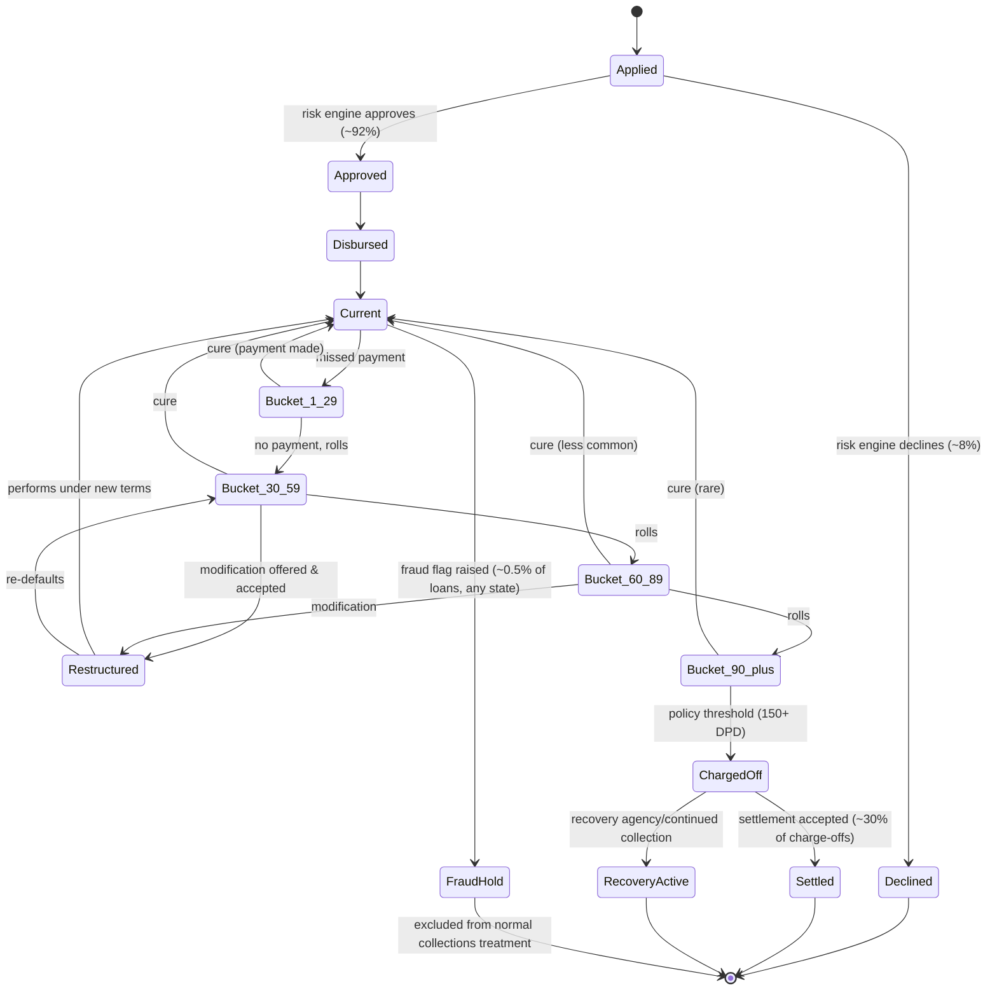

# Phase 4 — Dataset Design

**Traces to:** Phase 1 Section 8 (Synthetic Dataset requirements), Phase 3
star schema (every table below is designed to populate a specific Bronze
source → Silver conformed entity → Gold fact/dim from Phase 2/3).

This phase defines **what** Phase 5's Python/Faker generator scripts need
to produce: the entity/event catalog, the loan lifecycle state machine,
target volumetrics, and — most importantly — the exact, table-by-table
specification of every "realistic messiness" scenario from the original
brief, so Phase 5 is a mechanical implementation of a fully-specified
design rather than an ad hoc script.

---

## 1. Two Explicit Scale Profiles

Building literally "millions of loans" of raw synthetic data isn't a
useful portfolio artifact — it's expensive to generate, store, and review,
and an interviewer will never ask to see 5M rows. Instead we design two
profiles and generate one:

| Profile | Purpose | Loans | Customers | Time window | Grain of `delinquency_fact` |
|---|---|---|---|---|---|
| **Demo Scale (generated in Phase 5)** | What actually gets built, reviewed, and queried in this portfolio | **10,000** | **8,000** | **6 months** (Jan–Jun 2025) | Daily → ~1.8M rows |
| **Documented Production Scale (reference only)** | What the architecture (Phase 2) is designed for; used to talk through scaling in interviews | 3,000,000+ | 2,000,000+ | Multi-year, rolling retention (Phase 3 Section 3.2 note) | Daily for 24 months, weekly rollup beyond |

**Why this matters as a design decision, not just a shortcut:** every
partitioning, clustering, and incremental-processing choice in Phases
6–12 is justified against the *production* profile, while every row of
data anyone can actually open and inspect is at *demo* profile. Being
explicit about this gap — and being able to explain how the same
pipeline code scales from one to the other by config, not by rewrite —
is itself a strong interview answer (see Section 7).

---

## 2. Entity & Event Catalog

Per the original brief: **one loan generates** a specific, ordered set of
records across systems. This table is the master list Phase 5's generator
iterates per synthetic loan.

| # | Entity/Event | Source system | Frequency (per loan) | Feeds (Bronze table) |
|---|---|---|---|---|
| 1 | Application | Loan Servicing (origination module) | 1 | `raw_servicing` |
| 2 | Customer (incl. joint applicant if any) | CRM | 1–2 | `raw_crm` |
| 3 | Approval / Decline decision | Risk Engine | 1 | `raw_risk_scores` |
| 4 | Loan (terms, product) | Loan Servicing | 1 (+ restructure versions) | `raw_servicing` |
| 5 | Disbursement | Payment System | 1 | `raw_payments` |
| 6 | Scheduled payments | Payment System | 1/month while active | `raw_payments` |
| 7 | Missed payments | *(absence of a scheduled payment — not a separate positive event; detected downstream)* | 0–N | derived in Silver from `raw_payments` + `raw_servicing` due dates |
| 8 | Payment reversal / return | Payment System | 0–N | `raw_payments` |
| 9 | Delinquency status change | Loan Servicing (daily extract) | 1/day loan exists | `raw_servicing` |
| 10 | Collections case open/assign | Collections Platform | 0–1 per delinquency episode | `raw_collections` |
| 11 | Call center contact attempt | Call Center | 0–N | `raw_call_center` |
| 12 | Collections platform contact/action | Collections Platform | 0–N | `raw_collections` |
| 13 | Promise-to-pay | Collections Platform | 0–N | `raw_collections` |
| 14 | Recovery / settlement payment | Payment System | 0–N (post charge-off) | `raw_payments` |
| 15 | Risk score update | Risk Engine | Periodic (monthly) + event-driven (fraud) | `raw_risk_scores` |
| 16 | Bureau refresh | Credit Bureau | Periodic (monthly), frequently late/missing | `raw_bureau` |

---

## 3. Loan Lifecycle State Machine

This is the backbone the generator walks per synthetic loan — it
guarantees every loan's event stream is internally consistent (no
payments before disbursement, no collections events before delinquency,
etc.), which is exactly what makes the dataset "interconnected" rather
than randomly sampled per table.

Every state transition in this diagram is timestamped and drives the
daily `delinquency_fact` snapshot (Phase 3 Section 3.2), with `roll_flag`/
`cure_flag` set exactly on the transition day.

---

## 4. Volumetrics (Demo Scale — target row counts)

Formulas shown so Phase 5's script can be parameterized rather than
hard-coded, and so this table can be recomputed if we later change scale.

| Table | Formula | Target rows (approx.) |
|---|---|---|
| `customer_dim` (incl. SCD2 versions) | 8,000 customers × ~1.06 avg versions (5% relocate, few employment/segment changes) | ~8,500 |
| `loan_dim` (incl. SCD2 versions) | 10,000 loans × ~1.08 avg versions (restructures, charge-offs) | ~10,800 |
| `collector_dim` | 120 collectors × ~1.15 avg versions (reorg at month 4) | ~140 |
| `channel_dim` | Fixed reference set | 9 |
| `risk_band_dim` | 7 bands × 1 version (no recalibration in this window, noted as future scenario) | 7 |
| `time_dim` | Full calendar, 10-year span pre-populated | ~3,650 |
| `payment_fact` | 10,000 loans × ~6 scheduled/mo avg-active-months + ~15% extra/reversal/return events | ~69,000 |
| `delinquency_fact` | 10,000 loans × ~180 days (6 months) | ~1,800,000 |
| `contact_fact` | ~3,000 loans go delinquent at some point × ~4 contacts avg, plus routine automated reminders to ~60% of active loans monthly | ~40,000 |
| `promise_to_pay_fact` | ~35% of right-party-contact outbound calls on delinquent loans | ~3,500 |
| `loan_applicant_bridge` | ~15% of loans have a co-applicant | ~1,500 |

**Bronze layer inflation (deliberate, for realism):** Bronze row counts
run **3–5% higher** than the Silver-conformed counts above, because Bronze
preserves duplicate retries, pre-correction records, and rows later
quarantined — Bronze is *supposed* to be messier than Silver (Phase 2
Principle 1). Exact injection rates are in Section 5.

**Scaling narrative to Production profile (for interviews):** row counts
scale roughly linearly with loan count for everything except `time_dim`,
`channel_dim`, `risk_band_dim` (fixed reference data) — this linearity is
precisely why the pipeline design (partitioned by date, incremental
merges, no full-table rescans) doesn't change shape between 10,000 loans
and 3,000,000; only cluster/warehouse sizing and partition pruning
effectiveness change (Phases 10 & 12).

---

## 5. Realistic Scenario Catalog — mapped to tables, columns, and handling

This is the master specification for Phase 5. Every scenario below must
appear in the generated data at roughly the stated rate.

| # | Scenario | Injection rate | Tables/columns affected | How it manifests | Handled in |
|---|---|---|---|---|---|
| 1 | Late-arriving payment data | ~4% of payments | `raw_payments`: `effective_date` predates `file_date`/ingestion by 2–10 days | Payment posted with a backdated effective date, arrives in a later daily extract | Phase 7 (event-time reprocessing) |
| 2 | Late-arriving / missing bureau files | 2 specific outage days in the window + ~5% of customers delayed 1–2 weeks | `raw_bureau` | Entire daily file absent on outage days; individual customer records delayed | Phase 6 (freshness DQ check), Phase 7 (stale-band carry-forward with `is_stale_band` flag) |
| 3 | Schema drift — additive | 1 event mid-window | `raw_servicing` gains `loan_purpose_code` column starting month 3 | New nullable column appears; historical rows have it null | Phase 6 (`mergeSchema`, schema registry) |
| 4 | Schema drift — breaking (rename) | 1 event mid-window | `raw_collections`: `agent_id` renamed to `collector_ref_id` at a cutover date | Column rename breaks naive mapping if not caught | Phase 6 (schema-drift quarantine + alert) |
| 5 | Duplicate events | ~1% of `raw_payments` and `raw_call_center` rows | Same `payment_id`/`contact_id` lands twice (retry) | Exact or near-exact duplicate row, different `ingestion_ts` | Phase 7 (dedup on natural key + latest timestamp survives) |
| 6 | Payment reversals | ~2% of payments | `payment_fact.is_reversal_flag`, `original_payment_id` | Reversal posted 1–3 days after original, same amount negated | Phase 7 merge logic, Phase 3 self-referencing FK |
| 7 | Returned payments (NSF) | ~1.5% of ACH payments | `payment_fact.nsf_flag`, `payment_status = 'Returned'` | Returned 2–4 days after posting | Phase 8 (excluded from "cured" until re-paid) |
| 8 | Charge-offs | ~2% of loans reach 150+ DPD | `loan_dim.charge_off_flag/date`, `delinquency_fact.charge_off_flag` | Terminal delinquency-bucket state per Section 3 | Phase 3 SCD2 on `loan_dim` |
| 9 | Loan restructuring | ~3% of delinquent loans | New `loan_dim` SCD2 version, `restructured_flag`, new `interest_rate`/`loan_term_months` | Terms modified, past-due amount reset per new schedule | Phase 3 SCD2 |
| 10 | Settlement | ~30% of charged-off loans | `payment_fact.payment_type = 'Settlement'`, amount < full balance | One lump-sum payment closes the loan below full balance | Phase 8 recovery-rate KPI |
| 11 | Fraud flags | ~0.5% of loans, any lifecycle state | `loan_dim.fraud_flag`, `raw_risk_scores` event | Risk Engine emits a fraud event; loan pulled from normal collections treatment | Phase 3 `loan_dim`, Phase 8 (excluded from standard KPIs, footnoted) |
| 12 | Collector reassignment | 1 reorg event at month 4, affects ~40% of collectors | New `collector_dim` SCD2 version; `delinquency_fact.collector_sk` changes going forward | Team/manager changes; historical `contact_fact` rows keep the *old* `collector_sk` | Phase 3 SCD2 (critical for correct historical productivity attribution) |
| 13 | Corrupt source records | ~0.3% of all Bronze rows | Various: null required field, negative amount on a non-reversal row, garbled encoding | Malformed record from a simulated upstream extraction glitch | Phase 6/14 (quarantine table, DQ dashboard) |
| 14 | Holiday payment spikes/dips | Around ~10 major US bank holidays in the window | `payment_fact` volume by `payment_date` | Volume dip on/around the holiday, catch-up spike the next business day | `time_dim.is_us_bank_holiday`, Phase 8 seasonality note |
| 15 | Month-end spikes | Last 2–3 business days of each month | `payment_fact`, `promise_to_pay_fact.ptp_promised_date` | Elevated payment and PTP-fulfillment volume (paycheck timing) | `time_dim.is_month_end` |
| 16 | Seasonality | Ongoing trend over the 6-month window | `delinquency_fact.cure_flag` distribution | Slightly elevated new-delinquency in Jan (post-holiday spend), elevated cure rate Feb–Apr (tax refund season) | Phase 8 KPI trend narrative |
| 17 | Customer relocation | ~5% of customers | New `customer_dim` SCD2 version (address fields) | Mid-window address change | Phase 3 SCD2 |
| 18 | Multiple loans per customer | ~20% of customers have 2 loans, ~5% have 3+ | `loan_dim.primary_customer_sk` | Same `customer_sk` on multiple `loan_dim` rows | Phase 3 cardinality |
| 19 | Joint applicants | ~15% of loans | `loan_applicant_bridge(loan_sk, customer_sk, applicant_role)` | Second `customer_sk` linked with `applicant_role = 'Co-Applicant'` | Phase 3 Section 1 bridge design |

---

## 6. Data Dictionary — Source-System Entity Summary

(Full column-level Bronze schemas with types/metadata columns are built in
Phase 6; this is the conceptual entity-to-source map the generator scripts
key off of.)

| Source system | Core entities it owns | Natural key(s) it originates | Update pattern |
|---|---|---|---|
| Loan Servicing | Loan terms, delinquency status, due dates | `loan_id` | Daily batch, CDC |
| Payment System | Payment transactions, reversals, returns | `payment_id` | Daily batch, CDC; occasional late arrival |
| CRM | Customer demographic/contact info | `customer_id` (CRM-local) | Daily batch |
| Collections Platform | Cases, agent actions, PTPs | `case_id`, `ptp_id`, `collector_id` | Daily batch + streaming actions |
| Call Center | Call dispositions | `call_id` | Streaming, daily reconciliation batch |
| Credit Bureau | FICO score, tradeline summary | `customer_id` (bureau-local, requires matching) | Monthly batch, frequently late/missing |
| Risk Engine | Internal risk score, fraud signal | `loan_id` or `customer_id` | Daily batch + event-driven (fraud) |

**Identity resolution note:** CRM, Servicing, and Bureau each use a
*different* local customer identifier — this is deliberate (mirrors real
banking system fragmentation) and is exactly what Phase 7's
survivorship/matching logic resolves into the single `customer_id` golden
record used in `customer_dim`.

---

## 7. Design Rationale

**Why design two scale profiles instead of just generating a big
dataset:** a "big" synthetic dataset that we can't actually inspect,
query interactively, or explain row-by-row in an interview is worse than
a smaller one we know intimately. Explicitly separating "what we build"
from "what the architecture targets" also pre-empts the single most
common critique of student/portfolio data projects — "this doesn't look
like it'd survive real scale" — by answering it directly with a
documented scaling story instead of hand-waving.

**Why a state-machine-driven generator instead of independently randomizing
each table:** independently sampling each fact table (e.g., generating
`contact_fact` rows with no regard for whether the loan was ever actually
delinquent) is the classic tell of a low-effort synthetic dataset —
joins "work" schema-wise but the *data* doesn't hang together, and any
interviewer who runs a sanity join will find contacts on current loans or
payments before disbursement. Walking one state machine per loan and
emitting every entity/event from that walk (Section 3) guarantees
referential and temporal plausibility by construction.

**Why specific, quantified injection rates for messiness (Section 5)
rather than "add some randomness":** unquantified messiness can't be
regression-tested — Phase 14's DQ framework needs to know, for example,
"~2% of payments should be reversals" so it can assert observed rates are
in a sane range, and Phase 5's generator needs a concrete target to hit
and log deviation from.

**Common interview questions for this phase:**
- *"How did you make your synthetic data realistic instead of just random
  Faker output?"* → Section 3 state machine + Section 5 quantified,
  source-grounded scenario catalog.
- *"How would this dataset design change at real production scale?"* →
  Section 1's two-profile framing and Section 4's scaling narrative.
- *"Why inject schema drift and corrupt records into your own generated
  data?"* → Because the whole point of the platform (Phase 1 root cause)
  is handling exactly this kind of real-world messiness; a clean dataset
  would fail to exercise — or credibly demonstrate — Phases 6, 7, and 14.

---

## Next

**Phase 5 — Synthetic Data Generation**: the actual Python/Faker
generator scripts implementing Sections 2–5 of this document, producing
CSV/JSON/Parquet source-system extracts (one drop per simulated day) ready
to land as Bronze in Phase 6.

Say **"continue to Phase 5"** (or flag changes to Phase 4) when ready.
